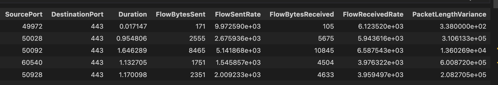
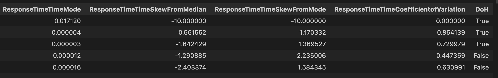

## Malicious DNS over Https traffic detection and mitigation
It's an MS research and developement project that encompasses variious Cyber Security and Computer Networking principles and practices. A program to test and validate collected datasets is developed using Python and Mininet, while emphasizing on Spanning Tree, TCP/IP, DNS, DHCP, SNTP & FTP protocols, OSI Model, attack vectors, Software Defined Network, and some machine learning algorithms. The thesis is successfully defended and the findings were approved by the committe of graduate research evaluation professors.

#### Sample Screenshots:

 
